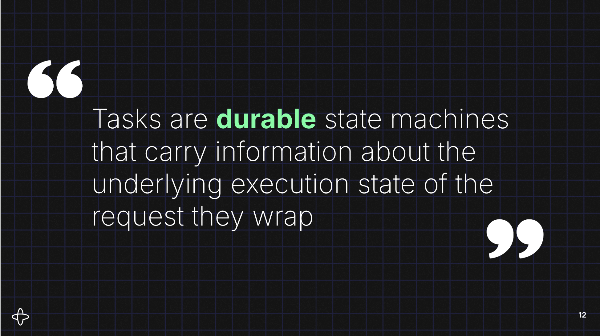

# Invoice Processing with Temporal + MCP

Demonstrates how to integrate Temporal durable workflows with the Model Context Protocol (MCP). An invoice processing workflow serves as the example business logic, with different MCP server implementations showing progressively more sophisticated integration patterns.

## Demo Progression

This repo is structured as a series of demos, each building on the same Temporal workflow but integrating with MCP differently:

### 1. [`bizservice/`](bizservice/README.md) — The Workflow Alone

Start here. The core business logic: an invoice processing workflow with ERP validation, human approval (via Temporal signals), and parallel line-item payments. Interact with it directly via Temporal and the included CLI — no MCP involved. This establishes the durable workflow that the MCP servers will front.

### 2. [`durable_sync_mcp/`](durable_sync_mcp/README.md) — Synchronous MCP Tools

The simplest MCP integration. Four individual tools (`process_invoice`, `approve_invoice`, `reject_invoice`, `invoice_status`) that the LLM orchestrates directly. Designed for **Claude Desktop** over stdio. The agent decides when to check status and when to approve, likely with human involvement — the MCP server is a thin pass-through to Temporal.

### 3. [`async_mcp/`](async_mcp/README.md) — MCP Tasks + Elicitation

The most advanced integration. A single `process_invoice` tool using **MCP Tasks** for async execution and **MCP Elicitation** for human-in-the-loop approvals. Custom task handlers map the MCP task lifecycle directly to Temporal workflows (workflow ID = task ID). Includes its own CLI client with concurrent background polling.

## Prerequisites

- Python 3.10+
- [`uv`](https://docs.astral.sh/uv/) for Python project management
- Temporal server ([Local Setup Guide](https://learn.temporal.io/getting_started/))
- An OpenAI API key (for the async MCP CLI client)

## Setup

```bash
git clone https://github.com/temporal-community/durable-async-mcp.git
cd durable-async-mcp
uv venv
source .venv/bin/activate
uv pip install -e .
```

Each subdirectory has its own README with detailed instructions for running that demo.

## Repository Structure

```
bizservice/          Temporal workflows, activities, worker, and CLI
durable_sync_mcp/    MCP server with synchronous tools (Claude Desktop)
async_mcp/           MCP server using Tasks + Elicitation
  mcp_client/        CLI client with concurrent background polling
samples/             Sample invoice JSON files
docs/                Design docs, research, and plans
```

## Accompanying materials

Here are slides for the talk given at the MCP Dev Summit NA 2026 <a href="assets/MCP Tasks_ Durable, Asynchronous, and Tricky.pdf">

</a>
## Acknowledgments

This project was inspired by and forked from [Aslan11/temporal-invoice-mcp](https://github.com/Aslan11/temporal-invoice-mcp).
