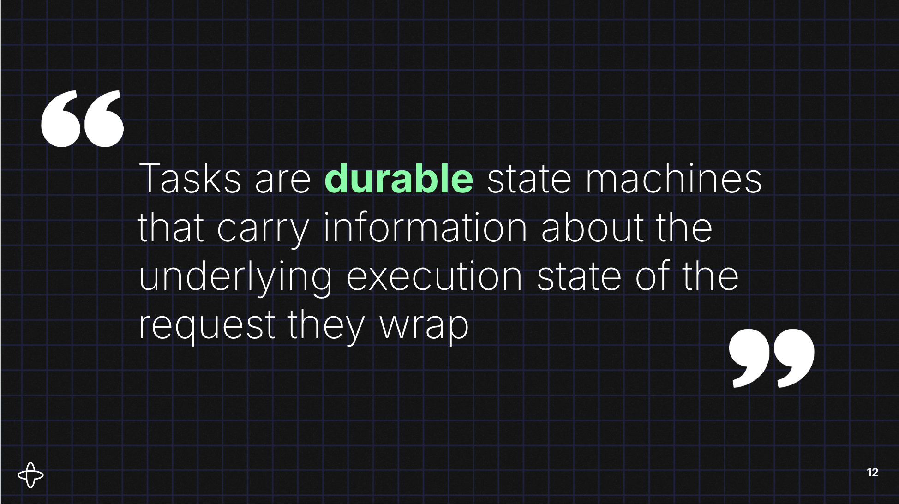

# Invoice Processing with Temporal + MCP

Demonstrates how to integrate Temporal durable workflows with the Model Context Protocol (MCP). An invoice processing workflow serves as the example business logic, with different MCP server implementations showing progressively more sophisticated integration patterns.

## Demo Progression

This repo is structured as a series of demos, each building on the same Temporal workflow but integrating with MCP differently:

### 1. [`bizservice/`](bizservice/README.md) — The Workflow Alone

Start here. The core business logic: an invoice processing workflow with ERP validation, human approval (via Temporal signals), and parallel line-item payments. Interact with it directly via Temporal and the included CLI — no MCP involved. This establishes the durable workflow that the MCP servers will front.

### 2. [`durable_sync_mcp/`](durable_sync_mcp/README.md) — Synchronous MCP Tools

The simplest MCP integration. Four individual tools (`process_invoice`, `approve_invoice`, `reject_invoice`, `invoice_status`) that the LLM orchestrates directly. Designed for **Claude Desktop** over stdio. The agent decides when to check status and when to approve, likely with human involvement — the MCP server is a thin pass-through to Temporal.

### 3. [`invoice_processing_mcp/`](invoice_processing_mcp/README.md) — MCP tasks (Temporal-backed)

The most advanced integration. A single `process_invoice` tool using the **FastMCP task protocol** (SEP-1686, `fastmcp==2.14.3`) for async execution with human-in-the-loop approval: while a task is `input_required`, the server **pushes** an `elicitation/create` during `tasks/result` and the client answers it. The protocol is implemented generically in [`mcp_tasks_temporal/`](mcp_tasks_temporal/) (distributed as a Temporal Plugin) and mapped to Temporal workflows (workflow ID = task ID). See [`docs/decisions/003-revert-to-v1-fastmcp-tasks.md`](docs/decisions/003-revert-to-v1-fastmcp-tasks.md) for how this reverted from the earlier v2 alpha pull-based extension.

The client side (`invoice_processing_mcp/client/`) uses a **Temporal-based worker** that manages the full MCP task lifecycle durably — one `TaskTrackerWorkflow` per task, adopted with a single `MCPTasksClientPlugin`, with a separate UI process that communicates only through Temporal signals and queries. This eliminates hand-rolled polling loops and makes the client as durable as the server. On top of that, a parent **`PurchaseOrderWorkflow`** shows the MCP task as just *one step* of a larger durable business process: it runs `process_invoice` as a child `TaskTrackerWorkflow` while doing back-office work (inventory, notifications, PO close) concurrently, and the invoice flow itself adds a second human gate (cost-center coding) for large invoices. A NiceGUI **status board** (`python -m invoice_processing_mcp.client.gui`) visualizes every purchase order and its invoice task's live lifecycle state, and answers pending human-in-the-loop questions inline.

## Prerequisites

- Python 3.10+
- [`uv`](https://docs.astral.sh/uv/) for Python project management
- Temporal server ([Local Setup Guide](https://learn.temporal.io/getting_started/))
- No API key needed (the durable client is LLM-free)

## Setup

```bash
git clone https://github.com/temporal-community/durable-async-mcp.git
cd durable-async-mcp
uv venv
source .venv/bin/activate
uv pip install -e ".[dev]"   # installs fastmcp==2.14.3 (pinned; pulls mcp 1.x)
```

Each subdirectory has its own README with detailed instructions for running that demo.

## Repository Structure

```
bizservice/             Temporal workflows, activities, worker, and CLI
mcp_tasks_temporal/     Reusable Temporal-backed FastMCP task protocol (+ client Temporal Plugin)
durable_sync_mcp/       FastMCP synchronous-tools server (out of scope, untested)
invoice_processing_mcp/ Invoice app (consumer of mcp_tasks_temporal):
  server/               The MCP server (process_invoice; InvoiceTaskBackend, workflow ID = task ID)
  client/               The durable client application (Temporal worker + CLI)
samples/                Sample invoice JSON files
docs/                   Design docs, research, and plans
```

## Accompanying materials

Here are slides for the talk given at the MCP Dev Summit NA 2026 <a href="assets/MCP Tasks_ Durable, Asynchronous, and Tricky.pdf">

</a>
## Acknowledgments

This project was inspired by and forked from [Aslan11/temporal-invoice-mcp](https://github.com/Aslan11/temporal-invoice-mcp).
