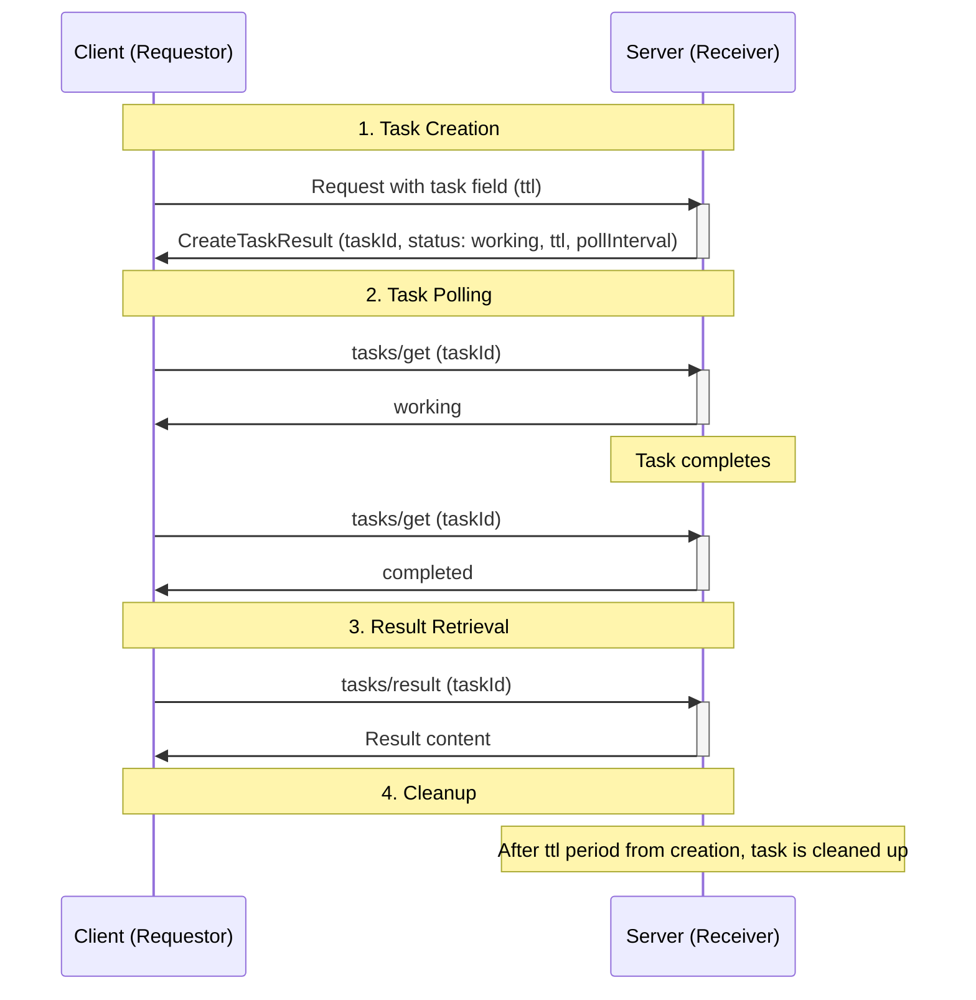
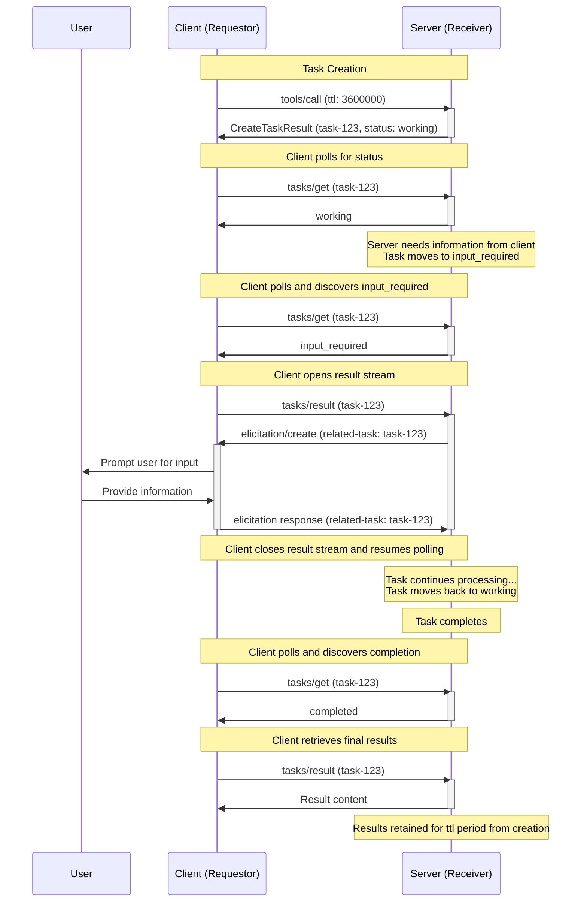
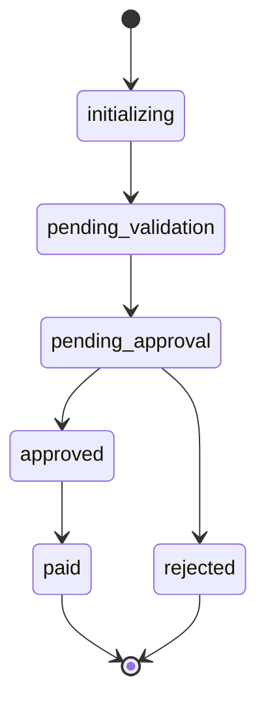

```mermaid
sequenceDiagram
    participant C as Client (Requestor)
    participant S as Server (Receiver)
    Note over C,S: 1. Task Creation
    C->>S: Request with task field (ttl)
    activate S
    S->>C: CreateTaskResult (taskId, status: working, ttl, pollInterval)
    deactivate S
    Note over C,S: 2. Task Polling
    C->>S: tasks/get (taskId)
    activate S
    S->>C: working
    deactivate S
    Note over S: Task completes
    C->>S: tasks/get (taskId)
    activate S
    S->>C: completed
    deactivate S
    Note over C,S: 3. Result Retrieval
    C->>S: tasks/result (taskId)
    activate S
    S->>C: Result content
    deactivate S
    Note over C,S: 4. Cleanup
    Note over S: After ttl period from creation, task is cleaned up
```

```mermaid
sequenceDiagram
    participant U as User
    participant C as Client (Requestor)
    participant S as Server (Receiver)

    Note over C,S: Task Creation
    C->>S: tools/call (ttl: 3600000)
    activate S
    S->>C: CreateTaskResult (task-123, status: working)
    deactivate S

    Note over C,S: Client polls for status
    C->>S: tasks/get (task-123)
    activate S
    S->>C: working
    deactivate S

    Note over S: Server needs information from client<br/>Task moves to input_required

    Note over C,S: Client polls and discovers input_required
    C->>S: tasks/get (task-123)
    activate S
    S->>C: input_required
    deactivate S

    Note over C,S: Client opens result stream
    C->>S: tasks/result (task-123)
    activate S
    S->>C: elicitation/create (related-task: task-123)
    activate C
    C->>U: Prompt user for input
    U->>C: Provide information
    C->>S: elicitation response (related-task: task-123)
    deactivate C
    deactivate S

    Note over C,S: Client closes result stream and resumes polling

    Note over S: Task continues processing...<br/>Task moves back to working

    Note over S: Task completes

    Note over C,S: Client polls and discovers completion
    C->>S: tasks/get (task-123)
    activate S
    S->>C: completed
    deactivate S

    Note over C,S: Client retrieves final results
    C->>S: tasks/result (task-123)
    activate S
    S->>C: Result content
    deactivate S

    Note over S: Results retained for ttl period from creation
```

```mermaid
stateDiagram-v2
    [*] --> initializing

    initializing --> pending_validation
    pending_validation --> pending_approval

    pending_approval --> approved
    pending_approval --> rejected

    approved --> paid

    paid --> [*]
    rejected --> [*]
```