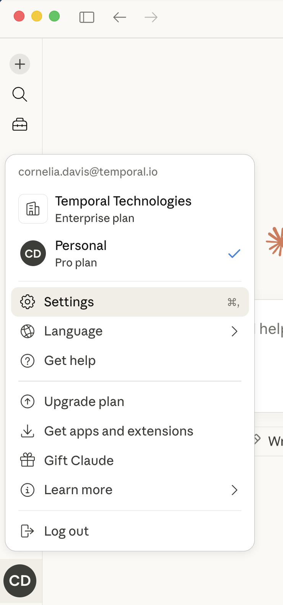
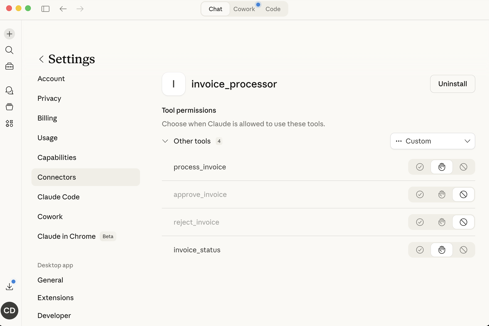

# Durable Sync MCP Server

A synchronous MCP server for invoice processing, designed for use with Claude Desktop over stdio. Unlike the `async_mcp` implementation, this server does **not** use MCP Tasks — instead it exposes individual tools that Claude orchestrates directly.

## Tools

| Tool | Description |
|------|-------------|
| `process_invoice` | Start a new invoice workflow. Returns `workflow_id` and `run_id`. |
| `approve_invoice` | Signal approval for a workflow in `PENDING-APPROVAL` state. |
| `reject_invoice` | Signal rejection for a workflow in `PENDING-APPROVAL` state. |
| `invoice_status` | Query the current status of a workflow. |

## Setup

### Prerequisites

- Python 3.10+
- [uv](https://docs.astral.sh/uv/) for Python project management
- A running Temporal server (default: `localhost:7233`)

### Install dependencies

From the repo root:

```bash
uv venv && source .venv/bin/activate
uv pip install -e .
```

### Configure Claude Desktop

Add the following to your Claude Desktop config file:

- **macOS**: `~/Library/Application Support/Claude/claude_desktop_config.json`
- **Windows**: `%APPDATA%\Claude\claude_desktop_config.json`

```json
{
  "mcpServers": {
    "invoice_processor": {
      "command": "/path/to/uv",
      "args": [
        "--directory",
        "/path/to/durable-async-mcp",
        "run",
        "durable_sync_mcp/server.py"
      ]
    }
  }
}
```

Replace `/path/to/uv` with the output of `which uv` and `/path/to/durable-async-mcp` with the absolute path to this repo.

### Configure tool permissions

By default, Claude Desktop blocks certain MCP tools from being called automatically. The `approve_invoice` and `reject_invoice` tools will require you to update their permissions so Claude can use them.

1. Open Claude Desktop and go to **Settings** (click your profile icon in the bottom-left, then select **Settings**, or use `Cmd + ,`).

   

2. In Settings, navigate to **Connectors** in the left sidebar, then click on **invoice_processor**.

3. Under **Tool permissions**, you'll see all four tools listed. Each tool has three permission options (left to right): auto-allow (checkmark), ask each time (hand), and block (circle with line). Set `approve_invoice` and `reject_invoice` to your preferred permission level — select the **checkmark** to allow Claude to call them automatically, or the **hand** icon if you want Claude to ask for confirmation each time.

   

## Running the Demo

```bash
# Terminal 1: Start Temporal server
temporal server start-dev

# Terminal 2: Start the worker
python -m bizservice.worker

# Then use Claude Desktop — the MCP server starts automatically via the config above.
```

### Typical conversation flow

1. Ask Claude to process an invoice (provide or reference a sample from `samples/`)
2. Claude calls `process_invoice` and gets back `workflow_id` + `run_id`
3. Claude can check status with `invoice_status`
4. When status is `PENDING-APPROVAL`, Claude asks you whether to approve or reject
5. Based on your answer, Claude calls `approve_invoice` or `reject_invoice`
6. Claude can continue checking `invoice_status` to track payment progress

## Environment Variables

| Variable | Default | Description |
|----------|---------|-------------|
| `TEMPORAL_ADDRESS` | `localhost:7233` | Temporal server address |

Worker-side variables (`--fail-validate`, `--fail-payment` flags or `FAIL_VALIDATE`, `FAIL_PAYMENT` env vars) control simulated failures — see `bizservice/worker.py`.
